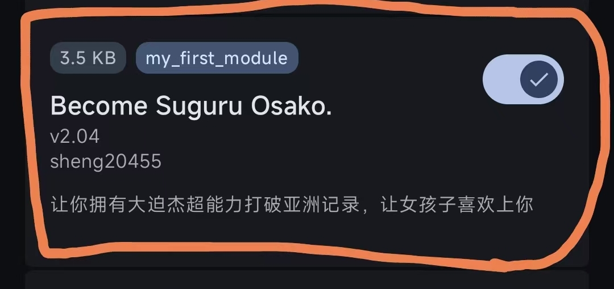

# 模块截图

## ROOT模块
这是一个简单的 Magisk 空壳模块

## 功能
*   无实际功能。

## 要求
*   Magisk，kerneISU，APatch，以及分支

## 安装方法
1.  下载本仓库的 [Release](https://github.com/sheng20455/BecomeSuguruOsako./releases) 压缩包。
2.  在 Magisk 管理器中从本地安装。
3.  重启手机。

## 更新日志
### v1.0
*   初始版本发布。
